# LAB1-1

#### 邵军阳

## 实验中遇到的问题

#### 一.配置实验环境的时候

在`.bashrc`中加入如下配置的时候：

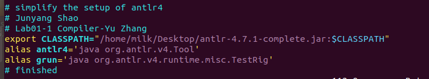

我一开始修改的是`/root`目录下的`.bashrc`.

而实际上，我发现这个`.bashrc`不会在每次打开terminal的时候执行，我应该修改的是`/home/milk`（我的用户名是`milk`）下的`.bashrc`.

然后问题解决啦. :)

#### 二.编写.g4文件的时候

​	1.`Identifier`的正规式:

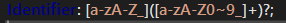

一开始我是这样子写的，但是当标识符出现数字的时候就会出现识别断裂. 后来我发现是`0-9`写成了`0~9`:

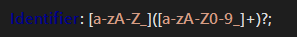

问题解决啦. :)

​	2.注释的正规式:

在考虑`//`类型的注释时，我写下了这个正规式:

`Comment2: ('/''\\n''/' | '//' )(('\\n' | NonNextline)+)? ->skip;`

但是它无法识别`//`注释的换行情况。

后来我发现应该写成:

`Comment2: ('/''\\''\n''/' | '//' )(('\\''\n' | NonNextline)+)? ->skip;`

这是因为反斜杠不只是`'\'`,而是`'\\'`. 因为第一个反斜杠默认是转义字符。

忘记了大一时候的常识。

问题解决啦。:)

## 分析与设计

这次实验只是词法分析器，所以没有很难。

### 单实例Token

对于只有一个实例的token，实现比较简单，把它们按ISO/IEC 9989标准抄出即可。

```
Comma: ',';
SemiColon: ';';
Assign: '=';
LeftBracket: '[';
RightBracket: ']';
LeftBrace: '{';
RightBrace: '}';
LeftParen: '(';
RightParen: ')';
If: 'if';
Else: 'else';
While: 'while';
Const: 'const';
Equal: '==';
NonEqual: '!=';
Less: '<';
Greater: '>';
LessEqual: '<=';
GreaterEqual: '>=';
Plus: '+';
Minus: '-';
Multiply: '*';
Divide: '/';
Modulo: '%';

Int: 'int';
Float: 'float';
Void: 'void';
```

### 常数和标识符

对于整形常数，浮点型常数，因为实例多，所以就要设计正规式了。

下面是我设计的正规式（其实也是按照ISO/IEC 9989的标准抄出来的啦.)

```
fragment Decimal_constant: '0' | [1-9]([0-9]+)?;
fragment Octal_constant: '0'[0-7]+;
fragment Hexadecimal_constant: ('0x'|'0X')[0-9A-F]+;
IntConst: Decimal_constant | Octal_constant | Hexadecimal_constant;

fragment Digit_sequence: [0-9]+;
fragment Sign: '+' | '-' ;
fragment Exponent_part: 'e'Sign?Digit_sequence | 'E'Sign?Digit_sequence;
fragment Fractional_constant: Digit_sequence'.'Digit_sequence | Digit_sequence'.' ;
fragment Decimal_floating_constant: Fractional_constant Exponent_part? | Digit_sequence Exponent_part;
FloatConst: Decimal_floating_constant;
```

在这里按照实验要求，忽略了后缀，并且浮点型只实现了十进制的，十六进制的没有实现。

但是还是把`Decimal_floating_constant`列了出来，目的是方便后期添加`Hex_floating_constant`.

对于标识符，按照标准：

`Identifier: [a-zA-Z_]([a-zA-Z0-9_]+)?;`

### 注释

对于注释，则比较复杂了。

`/* ... */`型注释的实现在作业中做过了, 实现如下：

```
fragment Other: ~'*';
fragment Other1: ~('*' | '/' );
Comment: '/*'(Other+)?(('*'+Other1 (Other+)?)+)?'*'+'/' -> skip;
```

`//`型注释则是我自己设计的，由于标准中没有给出正规式，所以我按照反斜杠换行的规则设计如下：

```
fragment NonNextline: ~'\n';
Comment2: ('/''\\''\n''/' | '//' )(('\\''\n' | NonNextline)+)? ->skip;
```

这里是这样考虑的：

`'\\'\n'`的组合是特殊的，在这里应该被“无视“掉，但是在外部定义一个`Special='\\''\n'->skip`，又会因为默认的最长匹配原则而导致在解读注释的时候它不会达到我们想要的效果。

在没有预处理器的情况下，我认为只能把这个字符组合的“被无视”在正规式里体现出来啦。

别忘了，还有一个空白符. :)

`WhiteSpace: [ \t\r\n]+ -> skip;`.

## 测试案例

### 正确案例

#### pt_1.c1

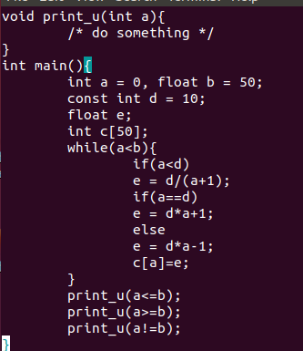

这个案例主要是测试单实例Token和标识符.

测试结果如下：

```
[@0,0:3='void',<'void'>,1:0]
[@1,5:11='print_u',<Identifier>,1:5]
[@2,12:12='(',<'('>,1:12]
[@3,13:15='int',<'int'>,1:13]
[@4,17:17='a',<Identifier>,1:17]
[@5,18:18=')',<')'>,1:18]
[@6,19:19='{',<'{'>,1:19]
[@7,41:41='}',<'}'>,3:0]
[@8,43:45='int',<'int'>,4:0]
[@9,47:50='main',<Identifier>,4:4]
[@10,51:51='(',<'('>,4:8]
[@11,52:52=')',<')'>,4:9]
[@12,53:53='{',<'{'>,4:10]
[@13,56:58='int',<'int'>,5:1]
[@14,60:60='a',<Identifier>,5:5]
[@15,62:62='=',<'='>,5:7]
[@16,64:64='0',<IntConst>,5:9]
[@17,65:65=',',<','>,5:10]
[@18,67:71='float',<'float'>,5:12]
[@19,73:73='b',<Identifier>,5:18]
[@20,75:75='=',<'='>,5:20]
[@21,77:78='50',<IntConst>,5:22]
[@22,79:79=';',<';'>,5:24]
[@23,82:86='const',<'const'>,6:1]
[@24,88:90='int',<'int'>,6:7]
[@25,92:92='d',<Identifier>,6:11]
[@26,94:94='=',<'='>,6:13]
[@27,96:97='10',<IntConst>,6:15]
[@28,98:98=';',<';'>,6:17]
[@29,101:105='float',<'float'>,7:1]
[@30,107:107='e',<Identifier>,7:7]
[@31,108:108=';',<';'>,7:8]
[@32,111:113='int',<'int'>,8:1]
[@33,115:115='c',<Identifier>,8:5]
[@34,116:116='[',<'['>,8:6]
[@35,117:118='50',<IntConst>,8:7]
[@36,119:119=']',<']'>,8:9]
[@37,120:120=';',<';'>,8:10]
[@38,123:127='while',<'while'>,9:1]
[@39,128:128='(',<'('>,9:6]
[@40,129:129='a',<Identifier>,9:7]
[@41,130:130='<',<'<'>,9:8]
[@42,131:131='b',<Identifier>,9:9]
[@43,132:132=')',<')'>,9:10]
[@44,133:133='{',<'{'>,9:11]
[@45,137:138='if',<'if'>,10:2]
[@46,139:139='(',<'('>,10:4]
[@47,140:140='a',<Identifier>,10:5]
[@48,141:141='<',<'<'>,10:6]
[@49,142:142='d',<Identifier>,10:7]
[@50,143:143=')',<')'>,10:8]
[@51,147:147='e',<Identifier>,11:2]
[@52,149:149='=',<'='>,11:4]
[@53,151:151='d',<Identifier>,11:6]
[@54,152:152='/',<'/'>,11:7]
[@55,153:153='(',<'('>,11:8]
[@56,154:154='a',<Identifier>,11:9]
[@57,155:155='+',<'+'>,11:10]
[@58,156:156='1',<IntConst>,11:11]
[@59,157:157=')',<')'>,11:12]
[@60,158:158=';',<';'>,11:13]
[@61,162:163='if',<'if'>,12:2]
[@62,164:164='(',<'('>,12:4]
[@63,165:165='a',<Identifier>,12:5]
[@64,166:167='==',<'=='>,12:6]
[@65,168:168='d',<Identifier>,12:8]
[@66,169:169=')',<')'>,12:9]
[@67,173:173='e',<Identifier>,13:2]
[@68,175:175='=',<'='>,13:4]
[@69,177:177='d',<Identifier>,13:6]
[@70,178:178='*',<'*'>,13:7]
[@71,179:179='a',<Identifier>,13:8]
[@72,180:180='+',<'+'>,13:9]
[@73,181:181='1',<IntConst>,13:10]
[@74,182:182=';',<';'>,13:11]
[@75,186:189='else',<'else'>,14:2]
[@76,193:193='e',<Identifier>,15:2]
[@77,195:195='=',<'='>,15:4]
[@78,197:197='d',<Identifier>,15:6]
[@79,198:198='*',<'*'>,15:7]
[@80,199:199='a',<Identifier>,15:8]
[@81,200:200='-',<'-'>,15:9]
[@82,201:201='1',<IntConst>,15:10]
[@83,202:202=';',<';'>,15:11]
[@84,206:206='c',<Identifier>,16:2]
[@85,207:207='[',<'['>,16:3]
[@86,208:208='a',<Identifier>,16:4]
[@87,209:209=']',<']'>,16:5]
[@88,210:210='=',<'='>,16:6]
[@89,211:211='e',<Identifier>,16:7]
[@90,212:212=';',<';'>,16:8]
[@91,215:215='}',<'}'>,17:1]
[@92,218:224='print_u',<Identifier>,18:1]
[@93,225:225='(',<'('>,18:8]
[@94,226:226='a',<Identifier>,18:9]
[@95,227:228='<=',<'<='>,18:10]
[@96,229:229='b',<Identifier>,18:12]
[@97,230:230=')',<')'>,18:13]
[@98,231:231=';',<';'>,18:14]
[@99,234:240='print_u',<Identifier>,19:1]
[@100,241:241='(',<'('>,19:8]
[@101,242:242='a',<Identifier>,19:9]
[@102,243:244='>=',<'>='>,19:10]
[@103,245:245='b',<Identifier>,19:12]
[@104,246:246=')',<')'>,19:13]
[@105,247:247=';',<';'>,19:14]
[@106,250:256='print_u',<Identifier>,20:1]
[@107,257:257='(',<'('>,20:8]
[@108,258:258='a',<Identifier>,20:9]
[@109,259:260='!=',<'!='>,20:10]
[@110,261:261='b',<Identifier>,20:12]
[@111,262:262=')',<')'>,20:13]
[@112,263:263=';',<';'>,20:14]
[@113,265:265='}',<'}'>,21:0]
[@114,268:267='<EOF>',<EOF>,22:0]
```

测试无误。

#### pt_2.c1

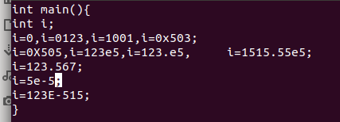

这个程序主要是测试常数和标识符，顺便测一下空白符的忽略。

测试结果如下：

```
[@0,0:2='int',<'int'>,1:0]
[@1,4:7='main',<Identifier>,1:4]
[@2,8:8='(',<'('>,1:8]
[@3,9:9=')',<')'>,1:9]
[@4,10:10='{',<'{'>,1:10]
[@5,12:14='int',<'int'>,2:0]
[@6,16:16='i',<Identifier>,2:4]
[@7,17:17=';',<';'>,2:5]
[@8,19:19='i',<Identifier>,3:0]
[@9,20:20='=',<'='>,3:1]
[@10,21:21='0',<IntConst>,3:2]
[@11,22:22=',',<','>,3:3]
[@12,23:23='i',<Identifier>,3:4]
[@13,24:24='=',<'='>,3:5]
[@14,25:28='0123',<IntConst>,3:6]
[@15,29:29=',',<','>,3:10]
[@16,30:30='i',<Identifier>,3:11]
[@17,31:31='=',<'='>,3:12]
[@18,32:35='1001',<IntConst>,3:13]
[@19,36:36=',',<','>,3:17]
[@20,37:37='i',<Identifier>,3:18]
[@21,38:38='=',<'='>,3:19]
[@22,39:43='0x503',<IntConst>,3:20]
[@23,44:44=';',<';'>,3:25]
[@24,46:46='i',<Identifier>,4:0]
[@25,47:47='=',<'='>,4:1]
[@26,48:52='0X505',<IntConst>,4:2]
[@27,53:53=',',<','>,4:7]
[@28,54:54='i',<Identifier>,4:8]
[@29,55:55='=',<'='>,4:9]
[@30,56:60='123e5',<FloatConst>,4:10]
[@31,61:61=',',<','>,4:15]
[@32,62:62='i',<Identifier>,4:16]
[@33,63:63='=',<'='>,4:17]
[@34,64:69='123.e5',<FloatConst>,4:18]
[@35,70:70=',',<','>,4:24]
[@36,76:76='i',<Identifier>,4:30]
[@37,77:77='=',<'='>,4:31]
[@38,78:86='1515.55e5',<FloatConst>,4:32]
[@39,87:87=';',<';'>,4:41]
[@40,89:89='i',<Identifier>,5:0]
[@41,90:90='=',<'='>,5:1]
[@42,91:97='123.567',<FloatConst>,5:2]
[@43,98:98=';',<';'>,5:9]
[@44,100:100='i',<Identifier>,6:0]
[@45,101:101='=',<'='>,6:1]
[@46,102:105='5e-5',<FloatConst>,6:2]
[@47,106:106=';',<';'>,6:6]
[@48,108:108='i',<Identifier>,7:0]
[@49,109:109='=',<'='>,7:1]
[@50,110:117='123E-515',<FloatConst>,7:2]
[@51,118:118=';',<';'>,7:10]
[@52,120:120='}',<'}'>,8:0]
[@53,122:121='<EOF>',<EOF>,9:0]
```

测试无误。

#### pt_3.c1

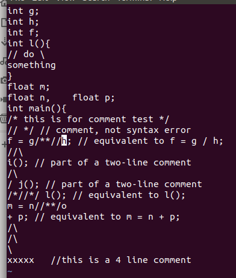

这个程序主要是测注释，它的等效程序如下：

```
int g;
int h;
int f;
int l(){}
float m;
float n,float p;
int main(){
    f=g/h;
    l();
    m=n+p;
}
```

测试结果如下：

```
[@0,0:2='int',<'int'>,1:0]
[@1,4:4='g',<Identifier>,1:4]
[@2,5:5=';',<';'>,1:5]
[@3,7:9='int',<'int'>,2:0]
[@4,11:11='h',<Identifier>,2:4]
[@5,12:12=';',<';'>,2:5]
[@6,14:16='int',<'int'>,3:0]
[@7,18:18='f',<Identifier>,3:4]
[@8,19:19=';',<';'>,3:5]
[@9,21:23='int',<'int'>,4:0]
[@10,25:25='l',<Identifier>,4:4]
[@11,26:26='(',<'('>,4:5]
[@12,27:27=')',<')'>,4:6]
[@13,28:28='{',<'{'>,4:7]
[@14,48:48='}',<'}'>,7:0]
[@15,50:54='float',<'float'>,8:0]
[@16,56:56='m',<Identifier>,8:6]
[@17,57:57=';',<';'>,8:7]
[@18,59:63='float',<'float'>,9:0]
[@19,65:65='n',<Identifier>,9:6]
[@20,66:66=',',<','>,9:7]
[@21,71:75='float',<'float'>,9:12]
[@22,77:77='p',<Identifier>,9:18]
[@23,78:78=';',<';'>,9:19]
[@24,80:82='int',<'int'>,10:0]
[@25,84:87='main',<Identifier>,10:4]
[@26,88:88='(',<'('>,10:8]
[@27,89:89=')',<')'>,10:9]
[@28,90:90='{',<'{'>,10:10]
[@29,158:158='f',<Identifier>,13:0]
[@30,160:160='=',<'='>,13:2]
[@31,162:162='g',<Identifier>,13:4]
[@32,167:167='/',<'/'>,13:9]
[@33,168:168='h',<Identifier>,13:10]
[@34,169:169=';',<';'>,13:11]
[@35,285:285='l',<Identifier>,18:7]
[@36,286:286='(',<'('>,18:8]
[@37,287:287=')',<')'>,18:9]
[@38,288:288=';',<';'>,18:10]
[@39,312:312='m',<Identifier>,19:0]
[@40,314:314='=',<'='>,19:2]
[@41,316:316='n',<Identifier>,19:4]
[@42,324:324='+',<'+'>,20:0]
[@43,326:326='p',<Identifier>,20:2]
[@44,327:327=';',<';'>,20:3]
[@45,398:397='<EOF>',<EOF>,25:0]
```

测试无误。

### 错误案例

#### ft_1.c1

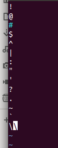

本例不是一个程序，但是因为只是测试词法分析所以没关系。

这里主要是测试未定义字符。

下面是结果：

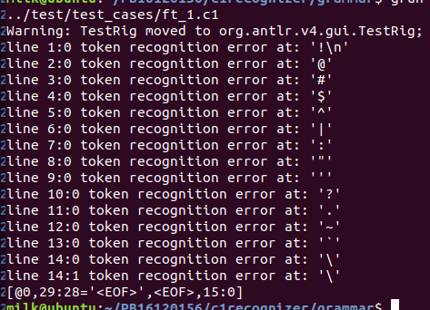

可见这些未定义字符都抛出了错误信息。

#### ft_2.c1

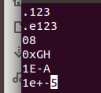

这个案例主要是测试不符合定义的常量。

结果如下：

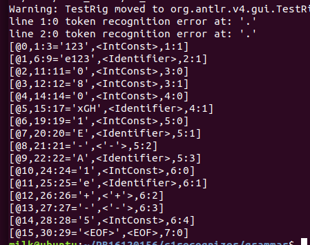

由于lexer的功能所限，它把错误的东西匹配成了别的可以代入的token类型，所以直接抛出error的只有'.'处的不良定义（主要是'.'这个token没有定义）。

#### ft_3.c1

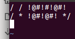

这个案例主要是测试注释的不良写法。

测试结果如下：

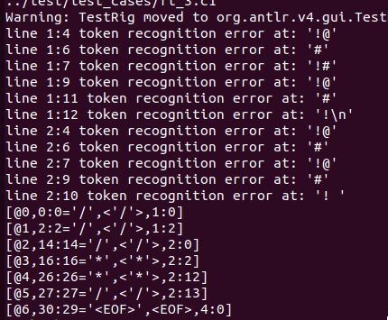

这里因为`//`之间多了空格，所以不是注释，后面的未定义字符导致了error.

同理，`/*`之间多了空格，未定义字符抛出error.

