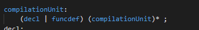
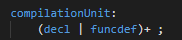
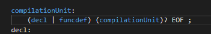
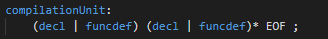

# 实验中遇到的问题、分析、设计

## 问题与分析解决

##### 文法`mutually recursive`导致不能运行antlr4。

分析与解决：

```
一开始不知道可以在parser的代码中使用（），？，*等表达式，在看了LL（\*）的介绍之后使用这些符号，简化了代码，解决了问题。
```

##### 读论文理解很困难，许多新的定义不了解。

分析与解决：

阅读方法不对，不需要完全理解。

最后通过无视“谓词”（predicate）来阅读，得到了更好的理解。

##### 写法不一致导致分析结果不一，虽然是等效写法。





这样写的时候，生成语法树是正常的，不会提示EOF未匹配。





但是上面那两种写法理应与第一种等效，它们却一定要匹配EOF，否则会报错。

这是antlr的设计导致的，暂时不明，为了保险起见使用第二种写法提交，因为第二种没有递归，生成的语法树会比较矮一些。

## 测试案例的设计

总共有3个正例，5个误例。

`pt_1.c1`综合测试了一个小型程序的parsing。

`pt_2.c1`测试了变量定义和赋值的许多情况。

`pt_3.c1`测试了表达式和表达式的嵌套。

`ft_1.c1`测试了函数的返回值类型定义只能是`void`，这里尝试了`int`结果失败了。

`ft_2.c1`测试了函数不能带有形参列表，这里带有形参因而失败了。

`ft_3.c1`测试了函数调用不能传递参数。

`ft_4.c1`测试了用逗号分隔的变量定义不能是两个不同的类型。

`ft_5.c1`测试了常量定义必须要有赋值。