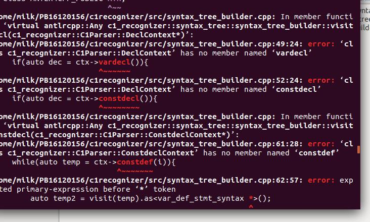
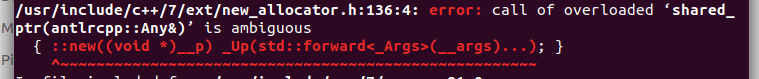

# LAB1-3

邵军阳	PB16120156

## 分析c1recognizer项目结构的内容

### CMakeLists.txt文件内容理解：

我想通过在文件里面添加注释来说明自己的理解

```
cmake_minimum_required(VERSION 3.5)
# 指定cmake的最低版本要求，此处为3.5

add_definitions(-DFULL_IMPL)
# 在当前文件夹中添加一个名为-DFULL_IMPL的flag，可以被当前路径及子路径中的文件检测到

set_property(DIRECTORY ${CMAKE_CURRENT_SOURCE_DIR}
       PROPERTY EP_UPDATE_DISCONNECTED 1)
# 给当前源文件夹添加属性 EP_UPDATE_DISCONNECTED，其值为1


list(APPEND CMAKE_MODULE_PATH ${CMAKE_CURRENT_SOURCE_DIR}/cmake)
# 将 ./cmake 加入CMake的搜索路径列表中，后面可以include这里面的文件 

# compiler must be 11 or 14
set(CMAKE_CXX_STANDARD 14)

# set variable pointing to the antlr tool that supports C++
set(ANTLR4CPP_JAR_LOCATION "NOT-FOUND" CACHE STRING "ANTLR v4 JAR file location. Used by antlr4cpp.")
# 取得ANTLR4CPP_JAR(实验一开始配置的那个java文件）的路径

# add external build for antlrcpp
include(ExternalAntlr4Cpp)
# 引入外部的.cmake文件，处理ANTLR语法文件代码生成

# add antrl4cpp artifacts to project environment
include_directories(${ANTLR4CPP_INCLUDE_DIRS})
link_directories(${ANTLR4CPP_LIBS})
message(STATUS "Found antlr4cpp libs: ${ANTLR4CPP_LIBS} and includes: ${ANTLR4CPP_INCLUDE_DIRS} ")
# 用到的变量在ExternalAntlr4Cpp.cmake中有定义，这里是将ANTLR4CPP相关的环境变量引入，包括路径啥的

# Call macro to add lexer and grammar to your build dependencies.
antlr4cpp_process_grammar(c1_recognizer c1_recognizer
  ${CMAKE_CURRENT_SOURCE_DIR}/grammar/C1Lexer.g4
  ${CMAKE_CURRENT_SOURCE_DIR}/grammar/C1Parser.g4)
# 此时外部build文件已经引入，可以使用它定义的宏 antlr4cpp_process_grammar 了
# 此步完成之后，antlr4已经产生分析器代码，并且已经加入List，可以在project环境中检测到


include(ExternalProject)
ExternalProject_Add(rapidjson
  PREFIX ${CMAKE_BINARY_DIR}/externals/rapidjson
  GIT_REPOSITORY https://github.com/Tencent/rapidjson.git
  GIT_TAG v1.1.0
  GIT_SUBMODULES ""
  CONFIGURE_COMMAND ""
  BUILD_COMMAND ""
  UPDATE_COMMAND ""
  INSTALL_COMMAND "")
ExternalProject_Get_Property(rapidjson DOWNLOAD_DIR)
set(rapidjson_include_dirs ${DOWNLOAD_DIR}/rapidjson/include)
# 引入用json格式显示分析结果的包rapidjson


# include generated files in project environment
include_directories(${antlr4cpp_include_dirs_c1_recognizer})
include_directories(include)
# 将前面产生的ANTLR文件引入

# add generated grammar to c1_recognizer binary target
add_library(c1recognizer
  src/error_listener.cpp
  src/error_reporter.cpp
  src/syntax_tree.cpp
  src/syntax_tree_builder.cpp
  src/recognizer.cpp
  ${antlr4cpp_src_files_c1_recognizer})
add_dependencies(c1recognizer antlr4cpp antlr4cpp_generation_c1_recognizer)
target_link_libraries(c1recognizer antlr4-runtime)
# 将c1recognizer/src中的源代码和ANTLR生成的代码作为项目的库。
# 设置库的依赖关系，进行库链接。


include_directories(${rapidjson_include_dirs})
add_executable(c1r_test test/main.cpp)
add_dependencies(c1r_test c1recognizer rapidjson)
target_link_libraries(c1r_test c1recognizer)
# 测试文件是最后生成的可执行文件
# 最终的可执行文件从test/main.cpp生成
# 添加可执行文件的依赖关系，进行库链接。

install(
  TARGETS c1recognizer
  RUNTIME DESTINATION bin
  LIBRARY DESTINATION lib
  ARCHIVE DESTINATION lib)

install(DIRECTORY include/c1recognizer DESTINATION include)

install(DIRECTORY ${ANTLR4CPP_LIBS}/ DESTINATION lib)

configure_file(c1recognizer-config.cmake.in c1recognizer-config.cmake @ONLY)

install(FILES ${CMAKE_CURRENT_BINARY_DIR}/c1recognizer-config.cmake DESTINATION cmake)

# 这部分代码供后面的实验使用
```

c1recognizer的目录下

文件夹：

​	· Libs_for_c1r_ref

​		这些主要是测试要用到的外部库

​	· cmake

​		里面只有一个文件 ExternalAntlr4Cpp.cmake。

​		按照它的注释，必须把这个文件放我们工作的文件夹里一个叫cmake的文件夹中。

​		它内部定义了一个宏；

​		它能被任意的cmakelists.txt引用（include），功能是使用antlr4生成语法文件的代码。

​	· grammar

​		这里放着我们写的C1词法和语法的描述文件。

​		用于在编译的时候生成相应的代码文件。

​	· include/c1recoginizer

​		这里包含的是src文件里面的.cpp文件会用到的.h文件，包括一些会在源代码中使用到的数据结构和接口的定义。

​	· src

​		本项目的源代码在这个文件夹里。

​		recognizer.cpp是最高层的部分，实现了execute方法，该方法首先启动字符流的处理，进行词法分析，然后启动错误监听器，再启动语法分析器，获得分析树之后，最后启动语法树生成，得到语法树。

​		其余代码是recognizer.cpp会用到的类、方法等及相关的头文件。

​	· test

​		测试文件和一个用于生成可执行程序的main.cpp，该代码里实例化了一个recognizer，并使用它的execute方法。该代码最终会被编译成为可执行程序，用于读取测试文件，作为我们的测试程序c1r_test。

文件：

​	· CMakeLists.txt

​		即CMakeLists

​	· c1r_ref_mac

​		测试用的参考文件，for mac

​	· c1r_ref_ubuntu

​		测试用的参考文件，for ubuntu

​	· c1recognizer-config.cmake.in

​		cmake的配置文件

## 编译和运行

### 遇到的问题

##### 1.make的时候遇到一堆不明的错误:



原因分析：旧的虚拟机坏掉后，我把内容复制粘贴到了新的虚拟机里，可能某些环境变量或者路径的设置出错了。

解决：重新从cmake开始编译。

##### 2.Shared_ptr ambiguous错误



原因： Visit的返回值是Any类型，在使用之前忘记使用.as<>来进行解包。

解决：加上.as<>。

## 实现与调试

### 遇到的问题

##### 1. bad_cast错误

原因分析：在VisitCompilationUnit函数中，把对funcdef的visit的返回值进行了错误的.as<>操作。

解决：改回来。

##### 2. segmentation fault错误

原因分析：修改了visitblock的实现，此时配套的C1Parser.g4应该不再有blockitem这个非终结符，但是我忘记把Parser改过来了。

解决：修改C1Parser.g4。

※改Parser的时候，我发现CompilationUnit后面没有加上EOF，顺手加上。

##### 3. cond_syntax中equal总是被识别为non_equal的错误

原因分析：不明

解决：重写了visitcond，就不再出现这个错误了。

